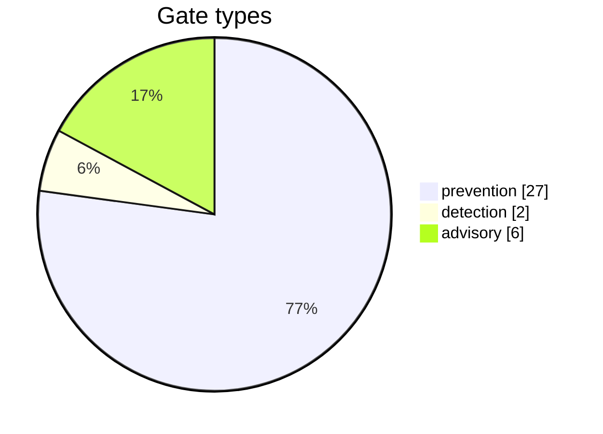
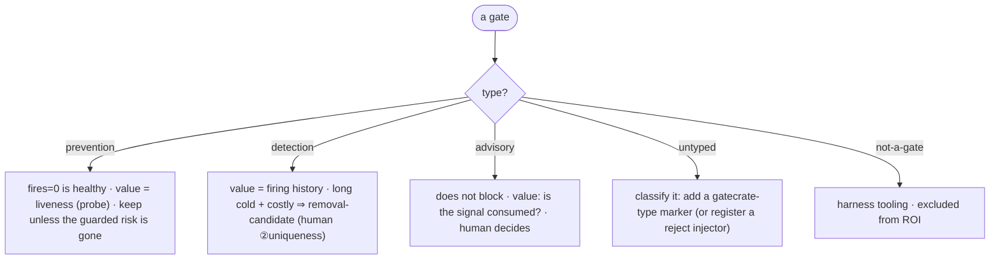

# gatecrate — harness status

<!-- AUTO-GENERATED by .github/workflows/dashboard.yml (render-harness-dashboard.sh --snapshot). Do not edit.
     Freshness = this file's last commit date on GitHub; the workflow opens a PR only when the table changes. -->

Committed snapshot so the dashboard is visible **from the repository**. The live per-run view is on each CI
run's Summary page; the README badge shows pass/fail. How it works: [`docs/harness-dashboard.md`](./harness-dashboard.md).

## 🛡️ Harness dashboard

**35 gates** · ✅ all classified · no DEAD gate

| metric | count |
|---|---:|
| 🛡️ prevention | 27 |
| 🎯 detection | 2 |
| 📊 advisory | 6 |
| ⚠️ untyped | 0 |
| ✅ ALIVE / ❌ DEAD / — not-probed | 11 / 0 / 24 |
| 🔧 tooling (not-a-gate, excluded) | 17 |




```mermaid
xychart-beta
    title "Total gates over time"
    x-axis ["06-20", "07-02", "07-10"]
    y-axis "gates" 0 --> 37
    line [18, 34, 35]
```

| Gate | Type | Liveness | ROI verdict | Next action |
|---|---|---|---|---|
| `check-bc-domain.sh` | prevention | — | — | add a synthetic reject injector, or mark escalation-only/not-probeable |
| `check-conventional-title.sh` | prevention | ✅ ALIVE | — | — |
| `check-diff-coverage.sh` | detection | — | — | collect firing history (gh) to judge ROI |
| `check-doc-currency.sh` | prevention | ✅ ALIVE | — | — |
| `check-domain-model.sh` | advisory | — | — | confirm the signal is consumed (human); else downgrade/remove |
| `check-es-assertions.sh` | prevention | — | — | add a synthetic reject injector, or mark escalation-only/not-probeable |
| `check-es-deliverables.sh` | prevention | — | — | add a synthetic reject injector, or mark escalation-only/not-probeable |
| `check-es-evidence.sh` | prevention | — | — | add a synthetic reject injector, or mark escalation-only/not-probeable |
| `check-evidence-resolves.sh` | prevention | — | — | add a synthetic reject injector, or mark escalation-only/not-probeable |
| `check-file-line-limit.sh` | prevention | ✅ ALIVE | — | — |
| `check-gate-classified.sh` | prevention | — | — | add a synthetic reject injector, or mark escalation-only/not-probeable |
| `check-gate-tests.sh` | prevention | — | — | add a synthetic reject injector, or mark escalation-only/not-probeable |
| `check-hard-constraints.sh` | prevention | — | — | add a synthetic reject injector, or mark escalation-only/not-probeable |
| `check-interaction-storming.sh` | prevention | — | — | add a synthetic reject injector, or mark escalation-only/not-probeable |
| `check-jargon.sh` | prevention | — | — | add a synthetic reject injector, or mark escalation-only/not-probeable |
| `check-kit-drift.sh` | advisory | — | — | confirm the signal is consumed (human); else downgrade/remove |
| `check-merge-integrity.sh` | prevention | ✅ ALIVE | — | — |
| `check-model-refuted.sh` | prevention | — | — | add a synthetic reject injector, or mark escalation-only/not-probeable |
| `check-modularity-ratchet.sh` | prevention | ✅ ALIVE | — | — |
| `check-mutation-escalation.sh` | prevention | ✅ ALIVE | — | — |
| `check-no-committed-secrets.sh` | prevention | ✅ ALIVE | — | — |
| `check-no-received-approvals.sh` | prevention | — | — | add a synthetic reject injector, or mark escalation-only/not-probeable |
| `check-posix-portability.sh` | prevention | ✅ ALIVE | — | — |
| `check-release-version-name.sh` | prevention | ✅ ALIVE | — | — |
| `check-rule-doc-currency.sh` | prevention | ✅ ALIVE | — | — |
| `check-term-relations.sh` | prevention | — | — | add a synthetic reject injector, or mark escalation-only/not-probeable |
| `check-test-compiles.sh` | detection | — | — | collect firing history (gh) to judge ROI |
| `check-third-party-notices.sh` | prevention | ✅ ALIVE | — | — |
| `es-cmap-lint.sh` | prevention | — | — | add a synthetic reject injector, or mark escalation-only/not-probeable |
| `es-coverage.sh` | advisory | — | — | confirm the signal is consumed (human); else downgrade/remove |
| `es-lint-info.sh` | prevention | — | — | add a synthetic reject injector, or mark escalation-only/not-probeable |
| `es-lint.sh` | prevention | — | — | add a synthetic reject injector, or mark escalation-only/not-probeable |
| `measure-complexity.sh` | advisory | — | — | confirm the signal is consumed (human); else downgrade/remove |
| `measure-coupling.sh` | advisory | — | — | confirm the signal is consumed (human); else downgrade/remove |
| `measure-modularity.sh` | advisory | — | — | confirm the signal is consumed (human); else downgrade/remove |

_Liveness from `probe-gate-liveness` (prevention gates without a synthetic injector show `—`); ROI verdict from `gate-roi-verdict` (needs a firing TSV / gh). **Next action** turns each non-final state (`—` not-probed, DEAD, untyped, unavailable ROI) into the concrete maintenance step; `—` in that column means healthy/no action. Tooling (not-a-gate) excluded._

### How gates are judged


